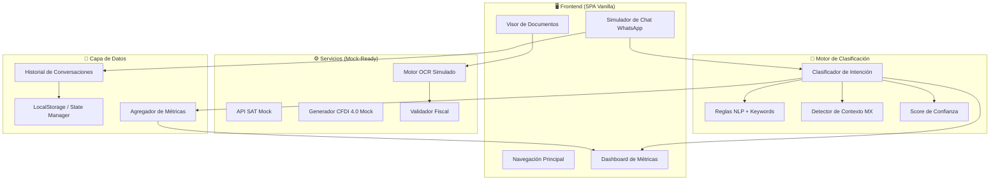

# Aliado RESICO — Plataforma de Recepción Contable Inteligente

Plataforma web que actúa como recepcionista contable automatizado para el régimen RESICO de México. Clasifica mensajes de WhatsApp, valida documentos fiscales (OCR), y orquesta flujos contables con conexión a APIs mexicanas.

## User Review Required

> [!IMPORTANT]
> **Prioridades definidas por el usuario:**
> 1. Motor de Clasificación de Intención (cerebro del sistema)
> 2. Dashboard de Métricas (valor inmediato al cliente)
> 3. OCR y validación documental (preparado pero simulado en MVP)

> [!WARNING]
> **APIs externas**: En este MVP, las conexiones a SAT, Facturama, y servicios OCR serán **simuladas con datos mock realistas**. La arquitectura estará lista para integrar APIs reales con solo cambiar los endpoints. ¿Apruebas este enfoque para el MVP?

## Open Questions

> [!IMPORTANT]
> 1. **Autenticación**: ¿El dashboard necesita login/contraseña, o es acceso abierto para esta fase?
> 2. **Persistencia**: ¿Usamos `localStorage` para el MVP, o prefieres conectar Supabase desde el inicio?
> 3. **WhatsApp Real**: ¿Tienes acceso a la API de WhatsApp Business / Twilio, o simulamos la interfaz de chat?
> 4. **Branding**: ¿Tienes colores/logo específicos, o diseño libre con estética premium contable?

---

## Arquitectura del Sistema



---

## Proposed Changes

### 1. Design System & Core Layout

Establece la identidad visual premium: dark mode contable, glassmorphism sutil, tipografía Inter, paleta profesional con acentos que evocan confianza fiscal.

#### [NEW] [index.html](file:///c:/Users/campe/Desktop/AliadoResico/index.html)
- Estructura SPA con navegación lateral
- 4 vistas principales: Dashboard, Chat/Clasificador, Documentos, Configuración
- Meta tags SEO y accesibilidad
- Google Fonts (Inter)
- IDs únicos en todos los elementos interactivos

#### [NEW] [styles.css](file:///c:/Users/campe/Desktop/AliadoResico/styles.css)
- CSS custom properties (design tokens): colores, espaciados, radios, sombras
- Dark mode como default con posibilidad de light mode
- Paleta: fondos `#0a0f1c` → `#111827`, acentos verdes `#10b981` (aprobado), ámbar `#f59e0b` (pendiente), rojo `#ef4444` (error), azul `#3b82f6` (info)
- Glassmorphism en tarjetas: `backdrop-filter: blur(12px)`, bordes sutiles
- Grid layout responsivo
- Animaciones: fade-in, slide-up, pulse para notificaciones
- Estilos específicos para cada categoría fiscal (colores únicos por intención)

---

### 2. Motor de Clasificación de Intención (Cerebro)

El clasificador analiza texto en español mexicano, detecta jerga fiscal coloquial, y asigna categoría + confianza.

#### [NEW] [js/classifier.js](file:///c:/Users/campe/Desktop/AliadoResico/js/classifier.js)
- **Clase `IntentClassifier`** con métodos:
  - `classify(message)` → `{ intent, confidence, keywords_matched, explanation }`
  - `preprocess(text)` → normalización: minúsculas, acentos, slang mapping
  - `detectContext(text)` → identifica contexto mexicano (SAT, chiva, RFC, etc.)
  - `scoreIntent(text, category)` → puntaje por categoría basado en keywords ponderados
- **Diccionarios de keywords por categoría:**
  - `CONSULTA_FISCAL`: resico, régimen, isr, tasa, límite, ingresos, sat, declaración, rif, persona física, actividad empresarial
  - `SOLICITUD_FACTURA`: factura, cfdi, timbrar, emitir, folio, rfc, uso cfdi, régimen fiscal, razón social, facturar
  - `REGISTRO_GASTO`: gasto, ticket, deducir, deducción, iva, compra, nota, recibo, pagué, gasté
  - `REPORTE_PAGO`: pago, transferencia, oxxo, depósito, comprobante, ficha, pagué, liquidar, saldo, referencia
  - `OTROS`: hola, buenos días, gracias, adiós, ayuda
- **Slang mexicano mapping**: "la chiva"→SAT, "el chivo"→SAT, "hacienda"→SAT, "el fisco"→SAT, "timbrar"→emitir CFDI
- **Multi-intent detection**: Si se detectan 2+ categorías con confianza similar, retorna la primaria + sugerencias
- **Confianza**: 0.0 - 1.0 basada en matches ponderados + contexto

#### [NEW] [js/conversation.js](file:///c:/Users/campe/Desktop/AliadoResico/js/conversation.js)
- **Clase `ConversationManager`**:
  - Gestiona el historial de conversaciones clasificadas
  - Genera respuestas automáticas por categoría
  - Templates de respuesta en español mexicano profesional
  - Flujo de follow-up por intención (ej: SOLICITUD_FACTURA → pedir RFC → pedir datos fiscales)

---

### 3. Dashboard de Métricas

Panel ejecutivo con KPIs en tiempo real, gráficas de distribución, y timeline de actividad.

#### [NEW] [js/dashboard.js](file:///c:/Users/campe/Desktop/AliadoResico/js/dashboard.js)
- **KPI Cards** (con animación de conteo):
  - Total mensajes procesados
  - Distribución por categoría (donut chart)
  - Confianza promedio del clasificador
  - Mensajes pendientes de atención
  - Tasa de resolución automática
- **Gráficas** (Canvas API nativo, sin dependencias):
  - Donut chart: distribución de intenciones
  - Bar chart: volumen por hora/día
  - Line chart: tendencia semanal
  - Heatmap: actividad por hora del día
- **Feed de actividad reciente**: últimos 20 mensajes clasificados con timestamp, categoría, y confianza
- **Filtros**: por fecha, categoría, nivel de confianza

---

### 4. Simulador de Chat WhatsApp

Interfaz que replica la experiencia de WhatsApp para demostrar el clasificador en acción.

#### [NEW] [js/chat.js](file:///c:/Users/campe/Desktop/AliadoResico/js/chat.js)
- UI estilo WhatsApp (burbujas, timestamps, checks de lectura)
- Input de texto + botón enviar + drag & drop para archivos
- Clasificación en tiempo real al enviar mensaje
- Badge visual con la categoría detectada en cada burbuja
- Respuestas automáticas del "asistente" según la intención
- Mensajes de ejemplo precargados para demo rápida
- Indicador de "escribiendo..." con animación

---

### 5. Motor OCR y Validación Documental (Mock-Ready)

#### [NEW] [js/ocr.js](file:///c:/Users/campe/Desktop/AliadoResico/js/ocr.js)
- **Clase `DocumentProcessor`**:
  - `processImage(file)` → simula OCR, retorna datos extraídos
  - `validateCFDI(data)` → valida estructura de CFDI 4.0
  - `validateRFC(rfc)` → validación de formato RFC (regex + dígito verificador)
  - `extractTicketData(ocrResult)` → extrae monto, fecha, concepto
- Formatos soportados (simulados): JPG, PNG, PDF
- Respuestas mock realistas con datos fiscales mexicanos

---

### 6. Estado y Datos

#### [NEW] [js/store.js](file:///c:/Users/campe/Desktop/AliadoResico/js/store.js)
- State manager reactivo con `Proxy`
- Persistencia en `localStorage`
- Eventos de cambio para actualizar UI
- Datos iniciales de demo (20-30 conversaciones pre-clasificadas para que el dashboard tenga contenido)

#### [NEW] [js/mock-data.js](file:///c:/Users/campe/Desktop/AliadoResico/js/mock-data.js)
- 30+ mensajes de ejemplo realistas en español mexicano
- Datos de clientes ficticios con RFC válidos (formato)
- Historial de conversaciones para demo
- Métricas pre-calculadas para el dashboard

---

### 7. Application Core

#### [NEW] [js/app.js](file:///c:/Users/campe/Desktop/AliadoResico/js/app.js)
- Router SPA (hash-based)
- Inicialización de módulos
- Event delegation
- Responsive sidebar toggle

---

## Estructura Final de Archivos

```
AliadoResico/
├── index.html              # SPA entry point
├── styles.css              # Design system completo
├── js/
│   ├── app.js              # Core application + router
│   ├── classifier.js       # 🧠 Motor de clasificación
│   ├── conversation.js     # Gestión de conversaciones
│   ├── dashboard.js        # 📊 Métricas y gráficas
│   ├── chat.js             # 💬 Simulador WhatsApp
│   ├── ocr.js              # 📄 Procesador de documentos
│   ├── store.js            # 💾 Estado y persistencia
│   └── mock-data.js        # 🎭 Datos de demostración
```

---

## Verification Plan

### Automated Tests
1. Ejecutar el clasificador contra un set de 30+ mensajes de prueba y verificar que la categoría asignada sea correcta en ≥90% de los casos
2. Validar que el RFC regex acepta formatos válidos y rechaza inválidos
3. Verificar responsive design en viewport móvil (375px) y desktop (1440px)

### Browser Testing
1. Abrir la aplicación y navegar por las 4 secciones
2. Enviar mensajes de prueba en el chat y verificar clasificación correcta
3. Verificar que el dashboard actualiza métricas en tiempo real
4. Probar drag & drop de archivos en el visor de documentos
5. Verificar animaciones y transiciones fluidas
6. Capturar screenshots del resultado final

### Test Messages (Clasificación Esperada)
| Mensaje | Categoría Esperada |
|---------|-------------------|
| "¿Cuánto es el límite de ingresos en RESICO?" | CONSULTA_FISCAL |
| "Necesito facturar una venta de $5,000" | SOLICITUD_FACTURA |
| "Te mando el ticket de la gasolina para deducir" | REGISTRO_GASTO |
| "Ya hice la transferencia, te mando captura" | REPORTE_PAGO |
| "Buenos días, ¿cómo están?" | OTROS |
| "La chiva me está pidiendo mi declaración" | CONSULTA_FISCAL |
| "Quiero timbrar un CFDI de honorarios" | SOLICITUD_FACTURA |
