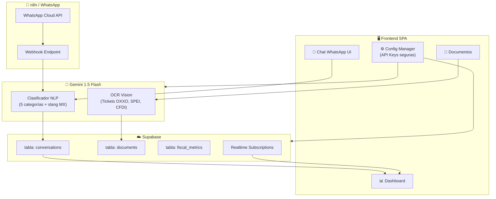

# Aliado RESICO — Migración a Producción con Gemini + Supabase + n8n

Refactorización completa del sistema para eliminar dependencias de mock-data y habilitar capacidades de producción con un stack gratuito: **Google Gemini 1.5 Flash** (clasificación NLP + OCR Vision), **Supabase** (persistencia en tiempo real), y preparación para **n8n + WhatsApp Cloud API**.

## User Review Required

> [!IMPORTANT]
> **API Keys necesarias antes de ejecutar:**
> 1. **Google Gemini API Key** — Gratis en [aistudio.google.com](https://aistudio.google.com). Límite generoso: 15 RPM / 1M tokens/día.
> 2. **Supabase Project** — Gratis en [supabase.com](https://supabase.com). Se necesita `URL` + `anon key` + crear tablas.
> 3. **n8n Webhook URL** (opcional para fase 1) — Se configurará cuando el workflow esté listo.

> [!WARNING]
> **Seguridad de API Keys:** Las claves se almacenarán en el panel de configuración de la app y en `localStorage` (cifrado básico). Para producción real, estas DEBEN migrar a un backend/proxy. ¿Aceptas este enfoque para la fase actual?

> [!CAUTION]
> **Breaking Change:** El sistema dejará de funcionar con datos mock por defecto. Se implementa un **fallback inteligente**: si las APIs no están configuradas, el sistema opera en "Modo Demo" con mock-data.js como respaldo.

## Open Questions

> [!IMPORTANT]
> 1. **¿Ya tienes la API Key de Gemini?** Si no, puedo mostrar exactamente cómo obtenerla (toma 2 minutos).
> 2. **¿Ya tienes un proyecto Supabase creado?** Necesitaré el URL y anon key para la configuración. Si no, puedo incluir el SQL para crear las tablas.
> 3. **¿Tienes una instancia de n8n corriendo?** (puede ser n8n cloud gratis o self-hosted). Si no, prepararemos la arquitectura pero el webhook quedará en modo placeholder.

---

## Arquitectura Refactorizada



---

## Proposed Changes

### 1. Capa de Configuración Centralizada

Nuevo módulo que centraliza todas las credenciales y configuración de APIs. Patrón Plug-and-Play.

#### [NEW] [js/config.js](file:///c:/Users/campe/Desktop/AliadoResico/js/config.js)
- **`AppConfig`** singleton con:
  - `getGeminiKey()` / `setGeminiKey(key)` — Almacenamiento seguro de API key
  - `getSupabaseConfig()` / `setSupabaseConfig({url, key})` — Credenciales Supabase
  - `getWebhookUrl()` / `setWebhookUrl(url)` — URL del webhook n8n
  - `isConfigured()` → `{gemini: bool, supabase: bool, webhook: bool}`
  - `getMode()` → `'production'` | `'demo'` (fallback automático si faltan keys)
- Cifrado básico con `btoa/atob` para claves en localStorage
- Eventos: `config:changed`, `config:mode-changed`

---

### 2. Refactorización del Clasificador → Gemini 1.5 Flash

Sustitución total del motor de keywords por llamadas a Gemini API con prompt engineering especializado en fiscalidad mexicana.

#### [MODIFY] [js/classifier.js](file:///c:/Users/campe/Desktop/AliadoResico/js/classifier.js)

**Cambios:**
- **Eliminar** los diccionarios `INTENT_KEYWORDS` (170 líneas) y la lógica de `scoreIntent`
- **Nuevo** `classifyWithGemini(message)`:
  - Llama a `https://generativelanguage.googleapis.com/v1beta/models/gemini-1.5-flash:generateContent`
  - Prompt system con las 5 categorías + definiciones + ejemplos de slang mexicano
  - Response schema forzado (JSON mode) → `{intent, confidence, keywords_detected, explanation, resico_context}`
  - Campo `resico_context` para distinguir ISR (ingresos brutos) vs IVA (gestión de gastos)
- **Preservar** `SLANG_MAP` como referencia en el prompt (no para lógica local)
- **Fallback**: Si la API falla o no hay key, usa el clasificador local existente de keywords
- **Cache**: Almacena clasificaciones recientes para mensajes idénticos (ahorra tokens)
- **Timeout**: 8 segundos máximo, luego fallback al clasificador local
- **Interfaz pública** sin cambios: `classify(message)` retorna el mismo formato

**Prompt Engineering:**
```
Eres un clasificador fiscal mexicano experto en RESICO. Clasifica el siguiente mensaje 
en UNA de estas categorías: CONSULTA_FISCAL, SOLICITUD_FACTURA, REGISTRO_GASTO, 
REPORTE_PAGO, OTROS.

CONTEXTO RESICO IMPORTANTE:
- ISR: Se paga sobre INGRESOS BRUTOS (1%-2.5%), NO hay deducciones
- IVA: SÍ permite acreditamiento, requiere gestión de gastos con factura
- Límite anual: $3,500,000 MXN

JERGA MEXICANA:
- "la chiva", "el chivo" = el SAT
- "timbrar", "sellar" = emitir factura CFDI
- "lana", "varo", "baro" = dinero
- "chambear", "jalar" = trabajar

Responde SOLO en JSON con este formato exacto...
```

---

### 3. Refactorización del OCR → Gemini Vision

Implementación real de procesamiento de imágenes usando las capacidades multimodales de Gemini 1.5 Flash.

#### [MODIFY] [js/ocr.js](file:///c:/Users/campe/Desktop/AliadoResico/js/ocr.js)

**Cambios:**
- **Reescribir** `processImage(file)`:
  - Convierte el archivo a Base64 usando `FileReader`
  - Envía a Gemini con `inlineData` (mime_type + base64)
  - Prompt especializado para extraer datos fiscales mexicanos:
    - RFC emisor/receptor (validación con regex existente)
    - Monto total, subtotal, IVA desglosado
    - Número de autorización / folio fiscal
    - Fecha de emisión
    - Método de pago
    - Tipo de documento (Ticket OXXO, transferencia SPEI, CFDI, nota de venta)
  - Response schema forzado (JSON)
- **Preservar** `validateRFC()` y `validateCFDI()` — lógica real que no depende de mock
- **Eliminar** `generateMockTicket()` y `generateMockCFDI()` — reemplazados por extracción real
- **Fallback**: Si Gemini no está configurado, retorna datos mock del formato anterior
- **Post-procesamiento**: Validar RFC extraído con `validateRFC()`, validar CFDI con `validateCFDI()`

**Prompt Vision:**
```
Analiza esta imagen de un documento fiscal mexicano y extrae los siguientes datos con 
máxima precisión. El documento puede ser: ticket de OXXO, comprobante de transferencia 
SPEI, factura CFDI, nota de venta, o recibo.

Extrae EXACTAMENTE estos campos en JSON...
```

---

### 4. Migración de Store → Supabase

Migración de localStorage a Supabase con sincronización en tiempo real, manteniendo el patrón reactivo existente.

#### [MODIFY] [js/store.js](file:///c:/Users/campe/Desktop/AliadoResico/js/store.js)

**Cambios:**
- **Agregar** import del SDK de Supabase (CDN: `@supabase/supabase-js@2`)
  - Se agrega vía `<script>` tag en index.html
- **Nuevo** `initSupabase()` — Inicializa cliente con URL y anon key de `AppConfig`
- **Modificar** `addConversation(conv)`:
  - Escribe primero en estado local (UX instantánea)
  - Luego sincroniza con tabla `conversations` en Supabase (fire-and-forget)
  - Manejo de errores: si falla Supabase, datos quedan en localStorage como respaldo
- **Nuevo** `subscribeToRealtime()`:
  - Suscripción a cambios en `conversations` para sincronización multi-dispositivo
  - Eventos: `INSERT`, `UPDATE`, `DELETE`
- **Modificar** `load()`:
  - Intenta cargar desde Supabase primero
  - Fallback a localStorage si Supabase no está disponible
- **Nuevo** `syncDocuments(doc)` — Guarda resultados de OCR en tabla `documents`
- **Nuevo** `updateFiscalMetrics()` — Actualiza métricas fiscales en tabla `fiscal_metrics`
- **Preservar** `exportJSON()`, `reset()`, `seedDemoData()` — operan sobre el estado local

**Tablas Supabase (SQL incluido):**
```sql
-- conversations: historial completo del clasificador
CREATE TABLE conversations (
  id TEXT PRIMARY KEY,
  text TEXT NOT NULL,
  sender TEXT DEFAULT 'Usuario',
  intent TEXT NOT NULL,
  confidence FLOAT,
  keywords TEXT[],
  explanation TEXT,
  response TEXT,
  created_at TIMESTAMPTZ DEFAULT now()
);

-- documents: resultados de OCR
CREATE TABLE documents (
  id UUID DEFAULT gen_random_uuid() PRIMARY KEY,
  file_name TEXT,
  doc_type TEXT,
  extracted_data JSONB,
  confidence FLOAT,
  validation_status TEXT,
  created_at TIMESTAMPTZ DEFAULT now()
);

-- fiscal_metrics: estado fiscal RESICO
CREATE TABLE fiscal_metrics (
  id UUID DEFAULT gen_random_uuid() PRIMARY KEY,
  income_ytd NUMERIC DEFAULT 0,
  total_processed INT DEFAULT 0,
  by_category JSONB DEFAULT '{}',
  avg_confidence FLOAT DEFAULT 0,
  updated_at TIMESTAMPTZ DEFAULT now()
);
```

---

### 5. Módulo Webhook n8n (Plug-and-Play)

Capa de integración preparada para recibir mensajes de WhatsApp vía n8n.

#### [NEW] [js/webhook.js](file:///c:/Users/campe/Desktop/AliadoResico/js/webhook.js)
- **`WebhookBridge`** module:
  - `sendToN8N(payload)` — Envía datos clasificados al webhook de n8n
  - `receiveFromWebhook(data)` — Procesa mensajes entrantes de WhatsApp
  - `formatWhatsAppResponse(classification, response)` — Formatea para WhatsApp Cloud API
  - Payload estándar:
    ```json
    {
      "source": "aliado_resico",
      "message": "texto original",
      "classification": { "intent": "...", "confidence": 0.95 },
      "response": "respuesta generada",
      "timestamp": "ISO 8601",
      "metadata": { "sender_phone": "...", "message_id": "..." }
    }
    ```
  - Rate limiting: máximo 30 mensajes/minuto
  - Retry con backoff exponencial (3 intentos)

---

### 6. Actualización del HTML y UI

#### [MODIFY] [index.html](file:///c:/Users/campe/Desktop/AliadoResico/index.html)

**Cambios:**
- **Agregar** `<script>` para Supabase JS CDN antes de los módulos:
  ```html
  <script src="https://cdn.jsdelivr.net/npm/@supabase/supabase-js@2"></script>
  ```
- **Agregar** `<script src="js/config.js">` como primer módulo (antes de store.js)
- **Agregar** `<script src="js/webhook.js">` después de classifier.js
- **Modificar** sección de Configuración (`view-settings`):
  - Nuevo panel: "🔑 API Keys" con inputs para Gemini Key, Supabase URL/Key, Webhook URL
  - Indicadores de estado de conexión (verde/rojo) para cada servicio
  - Botón "Test Connection" para cada API
  - Badge de modo actual: "🟢 Producción" o "🟡 Demo"
- **Modificar** sidebar footer:
  - Cambiar "Motor IA activo" → estado dinámico según modo (Gemini/Demo)

---

### 7. Preservar mock-data.js como Fallback

#### [MODIFY] [js/mock-data.js](file:///c:/Users/campe/Desktop/AliadoResico/js/mock-data.js)

**Cambios mínimos:**
- El archivo se **preserva completo** como sistema de fallback
- Se agrega `CATEGORY_CONFIG`, `ISR_RESICO_TABLE`, `RESICO_INCOME_LIMIT` — estos son datos de referencia, NO mock data
- Se separa conceptualmente: datos de demostración (mock messages/clients) vs datos de referencia fiscal (tablas ISR, config)
- El sistema automáticamente los usa cuando `AppConfig.getMode() === 'demo'`

---

### 8. Lógica de Negocio RESICO Integrada

Se refuerza en todos los módulos la distinción clave del régimen:

| Concepto | ISR | IVA |
|----------|-----|-----|
| Base | Ingresos brutos facturados | Diferencia IVA cobrado - IVA pagado |
| Deducciones | ❌ NO aplican | ✅ SÍ, con factura |
| Gestión de gastos | Irrelevante para ISR | **Indispensable** para acreditamiento |
| Tasas | 1% - 2.5% según ingreso | 16% estándar |

Esta lógica se refleja en:
- `classifier.js`: El prompt de Gemini incluye esta distinción
- `conversation.js`: Los templates de respuesta explican la diferencia
- `dashboard.js`: Separación visual de ISR vs IVA en métricas
- `ocr.js`: Extrae IVA desglosado específicamente para acreditamiento

---

## Verification Plan

### Automated Tests
1. **Clasificador Gemini**: Enviar los 34 mensajes de `MOCK_MESSAGES` y verificar ≥95% accuracy
2. **Fallback**: Desconectar API key y verificar que el clasificador local toma el relevo
3. **Supabase**: Insertar conversación y verificar que aparece en la tabla via SQL
4. **OCR**: Subir imagen de ticket de prueba y verificar extracción de campos

### Browser Testing
1. Abrir app → verificar que detecta modo Demo si no hay keys configuradas
2. Configurar API keys → verificar transición a modo Producción
3. Enviar mensajes en chat → clasificación vía Gemini con respuesta en <3 segundos
4. Subir imagen → extracción de datos fiscales vía Gemini Vision
5. Verificar que dashboard actualiza en tiempo real
6. Verificar estética Premium Contable intacta (Dark Mode, Glassmorphism)
7. Probar en móvil (responsive)

### Manual Verification
- Verificar que las API keys se persisten entre sesiones
- Verificar que el fallback funciona cortando internet
- Revisar la consola del navegador: zero errors en modo producción
